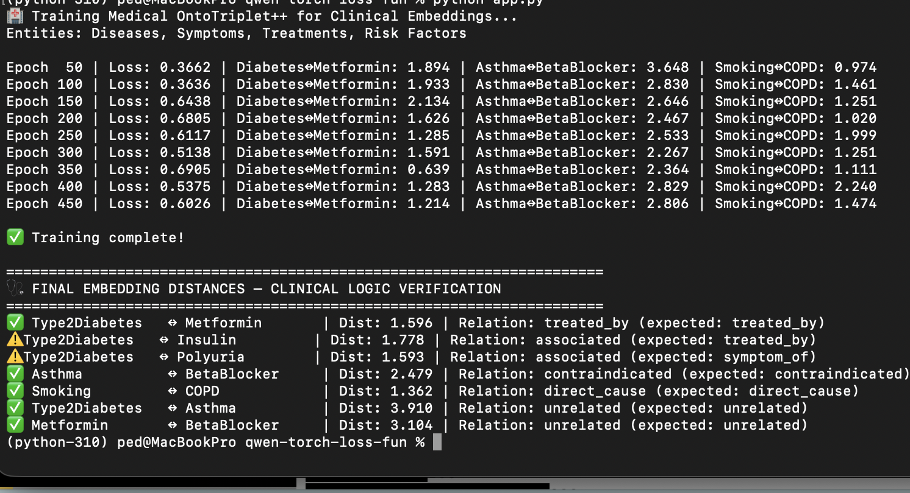

# Medical Knowledge Graph Embedding with PyTorch

[](https://github.com/rampedro/medical-embedding)

## Overview

This project implements a medical knowledge graph embedding using PyTorch. It aims to learn meaningful representations of medical entities (diseases, symptoms, treatments, risk factors) and their relationships.  The learned embeddings can be used for various downstream tasks, such as medical diagnosis, drug repurposing, and personalized treatment recommendations.  The core of the project utilizes an `OntoTriplet++` loss function to ensure a clinically sound embedding space.

## Features

*   **Medical Ontology:** Defines a specific medical vocabulary with diseases, symptoms, treatments, and risk factors.
*   **Clinical Feature Generation:** Generates synthetic clinical features associated with each medical entity.
*   **Knowledge Graph Embedding:** Learns embeddings for medical entities and their relationships.
*   **OntoTriplet++ Loss:** Implements a specialized loss function designed to capture complex relationships in medical knowledge graphs.
*   **PyTorch Implementation:** Leverages the flexibility and performance of the PyTorch deep learning framework.

## Technologies Used

*   **Python:** Primary programming language.
*   **PyTorch:** Deep learning framework.
*   **NumPy:** Numerical computation library.

## Getting Started

### Prerequisites

*   Python 3.8 or higher
*   PyTorch (install according to your system and CUDA availability – see [https://pytorch.org/get-started/locally/](https://pytorch.org/get-started/locally/))
*   NumPy (`pip install numpy`)

### Installation

1.  Clone the repository:

    ```bash
    git clone https://github.com/your-username/medical-embedding.git
    cd medical-embedding
    ```

2.  Install the required dependencies (if not already installed):

    ```bash
    pip install torch numpy
    ```

### Running the Code

1.  Execute the main script:

    ```bash
    python src/main.py
    ```

    This will train the model and print the training progress and evaluation metrics.

## Project Structure

*   `src/main.py`: Main training and evaluation script.
*   `README.md`: Project documentation.

## Image Placeholder

A project logo or representative image should be placed in the `placeholder_image.png` file.  This image will be displayed at the top of the README file.  Replace `placeholder_image.png` with your desired image.

## Evaluation Metrics

The code evaluates the learned embeddings by calculating the pairwise distance between related entities and verifying if the inferred relationships align with the expected clinical logic. The output provides a summary of the distances and relationships for selected entity pairs.

## Contributions

Feel free to contribute to this project by submitting pull requests or opening issues.

## License

This project is licensed under the [MIT License](LICENSE).